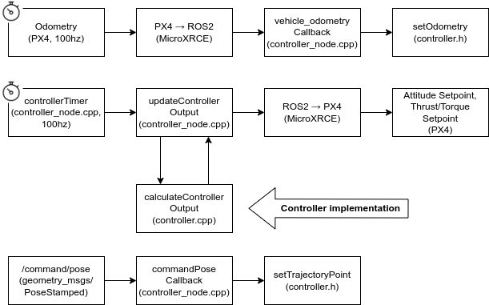

# Explanation
The ``px4_offboard_lowlevel`` node of this package consists of [``controller_node.cpp``](/src/controller_node.cpp) for the ControllerNode class which handles communication to ROS2 and PX4, and [``controller.cpp``](/src/controller.cpp) which contains the controller itself, both have corresponding header files in [``include/px4_offboard_lowlevel``](/include/px4_offboard_lowlevel). For the implementation of your own controller you will probably only need to make changes to [``controller_node.cpp``](/src/controller_node.cpp).

# Overview


# ControllerNode
The ControllerNode class implements the interface between the controller, ROS2 and PX4. It provides the controller with odometry and setpoints, and it requests the controller to calculate desired outputs (attitude or thrust + torque) at a set interval.

# Controller
The Controller class implements the controller itself.
## Controller output
The desired output is requested by the ControlledNode using the calculateControllerOutput function. It takes a vector for thrust and torque and a quaternion for orientation, these should both be set to the desired values. This may be the only function you need to change to implement your own controller.
```CPP
calculateControllerOutput(Eigen::VectorXd *controller_torque_thrust, Eigen::Quaterniond *desired_quaternion)
```

## Other interfaces
### UAV Parameters
UAV Parameters are passed to the controller using the following functions:
```CPP
setUavMass(double uavMass)
setInertiaMatrix(const Eigen::Vector3d &inertiaMatrix)
setGravity(double gravity)
setKPositionGain(const Eigen::Vector3d &PositionGain)
setKVelocityGain(const Eigen::Vector3d &VelocityGain)
setKAttitudeGain(const Eigen::Vector3d &AttitudeGain)
setKAngularRateGain(Eigen::Vector3d AngularRateGain)
```

### Odometry
Odometry (position, orientation, velocity and angular velocity) is provided to the controller through the setOdometry funciton, this is called by the ControllerNode class every time odometry is received from PX4. 

```CPP
const Eigen::Vector3d &position_W, const Eigen::Quaterniond &orientation_W)
```

### Setpoints
Position and orientation setpoints are provided to the controller through the setTrajectoryPoint function.

```CPP
setTrajectoryPoint(const Eigen::Vector3d &position_W, const Eigen::Quaterniond &orientation_W)
```

## Working with another vehicles

Check the parameters that needs to be defined for each vehicle in `./config/uav_parameters/iris_param.yaml`. By creating another parameters yaml file and another launch file based on `./launch/iris_sitl.launch.py`, you should be able to fly another vehicle with the package.


## Explanation of Feedback Linearization Controller Code
A  detailed breakdown of the calculateFBLControllerOutput() function and its components, used in the Feedback Linearization (FBL) controller.

# 1. State Initialization
The function starts by initializing the state variables, capturing the drone's position, orientation (roll, pitch, yaw), and velocity (both linear and angular). The orientation is calculated from the quaternion R_B_W_.
```CPP
// Initialize variables with current states
   // Position (x, y, z)
   double x = position_W_(0);
   double y = position_W_(1);
   double z = position_W_(2);

   // Orientation (roll, pitch, yaw)
   double ps = std::atan2(R_B_W_(1,0), R_B_W_(0,0));

    // Pitch (θ, theta) - Rotation around Y-axis
    double th= std::asin(-R_B_W_(2,0));

    // Roll (ϕ, phi) - Rotation around X-axis
    double ph= std::atan2(R_B_W_(2,1), R_B_W_(2,2));

   // Linear velocities (vx, vy, vz)
   double vx = velocity_W_(0);
   double vy = velocity_W_(1);
   double vz = velocity_W_(2);

   // Angular velocities (p, q, r)
   double p = angular_velocity_B_(0);
   double q = angular_velocity_B_(1);
   double r = angular_velocity_B_(2);
```


# 2. Control Gains
The control gains (e.g., k1, k2) are preset values from MATLAB simulations and are critical in shaping the drone's response to deviations from its target state.
```cpp
 // Control gains
    double k1 = 200.0;
    double k2 = 400.0;
```


# 3. Desired Trajectory
Parameters like des_radius, des_height, and des_yaw define a circular trajectory for the drone, providing a reference path.
```cpp
   double des_radius = 5.0;
   double des_height = 5.0;
   double des_yaw = 0.0;
```

# 4. FBL State Calculations
Variables named Lg1Lf3S1, Lg2Lf3S1, etc., are derivatives and control input components based on the FBL principles. These help in linearizing the system dynamics.

# 5. Torque and Thrust Calculation
The main control output, tau, consists of three torques, and thrust is a scalar force to achieve stability along the path.

# 6. Logging for Analysis
The function logs the controller's states for post-simulation analysis.